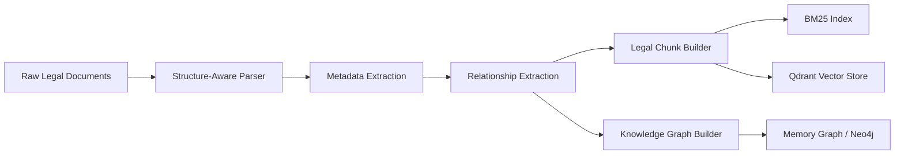
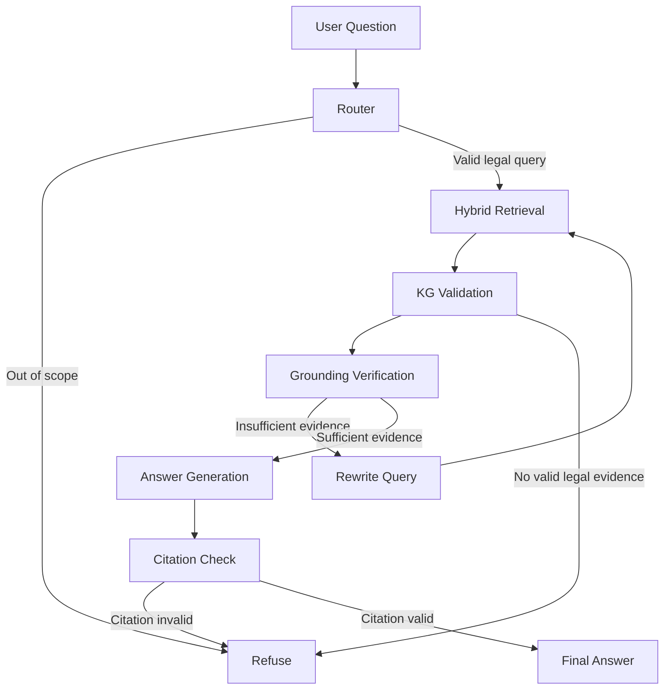
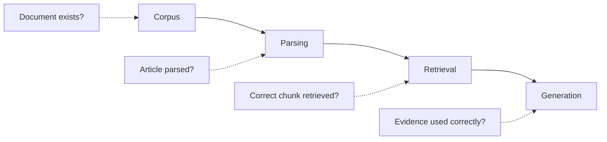

# Vietnamese Legal AI Agent

A production-oriented, version-aware RAG agent for Vietnamese legal question answering.

The system combines **hybrid retrieval, reranking, a Legal Knowledge Graph, LangGraph orchestration, deterministic citation validation, evaluation, monitoring, and refusal policies** to make legal answers grounded in retrieved evidence instead of unsupported model knowledge.

> **Disclaimer:** This project is an information-retrieval and research system. It does not replace legal advice from a qualified lawyer or an authorized government agency.

**Live Demo:** [Add demo link here](YOUR_DEMO_LINK)

---

## 1. Overview

Legal question answering is harder than ordinary document search.

A useful system must answer the right provision, distinguish between active and expired documents, follow relationships between laws and guiding documents, and avoid generating an answer when the evidence is insufficient.

This project addresses the problem with two core principles:

1. **Grounded-or-refuse**  
   The agent can only answer from retrieved and validated legal evidence. If the evidence is insufficient, the system refuses instead of guessing.

2. **Version-aware reasoning**  
   Legal documents are checked against their effective status and relationships before they can support an answer.

The result is a controlled RAG workflow designed around **traceability, correctness, and measurable quality**.

---

## 2. Key Features

- Structure-aware parsing of Vietnamese legal documents
- Legal hierarchy extraction: Document → Chapter → Section → Article → Clause → Point
- Metadata extraction for document number, authority, dates, and legal status
- Rule-based legal relationship extraction
- Hybrid retrieval using:
  - BM25 sparse retrieval
  - Dense vector retrieval
  - Reciprocal Rank Fusion (RRF)
  - Cross-encoder reranking
- Legal Knowledge Graph for version and relationship validation
- LangGraph multi-step agent workflow
- Query rewriting and retrieval self-correction
- Deterministic citation auditing
- Grounding and claim-support verification
- Explicit refusal paths for unsupported answers
- FastAPI REST API
- Streamlit interface
- Offline MVP mode with deterministic stubs
- Production-shaped Qdrant + Neo4j + vLLM deployment
- Golden-set evaluation and regression testing
- Runtime monitoring and latency metrics
- CI pipeline with linting, tests, evaluation gates, and Docker validation

---

## 3. System Architecture

The architecture separates **offline knowledge preparation** from the **online agent workflow**.

### 1. Offline Ingestion Pipeline



The ingestion pipeline preserves legal structure instead of splitting documents by arbitrary character length.

A chunk normally represents a **Clause**, or an entire **Article** when no clauses exist. Long clauses are only split at meaningful legal boundaries such as Points.

This makes every retrieved chunk directly usable as evidence and citation material.

---

### 2. Online Agent Pipeline



The agent is intentionally not a simple:

```text
Question → Retrieve → LLM → Answer
```

Instead, it treats retrieval quality, legal validity, and citation correctness as explicit control points.

---

## 4. Agent Responsibilities

| Component | Responsibility |
|---|---|
| `router` | Classifies intent, rewrites queries, extracts document/article references, and routes requests |
| `retrieve` | Runs dense + sparse retrieval, fuses rankings with RRF, and reranks candidates |
| `kg_validate` | Checks legal status and follows relevant document relationships |
| `verify` | Measures grounding quality and decides whether another retrieval attempt is needed |
| `answer` | Generates an answer strictly from validated evidence |
| `citation_check` | Deterministically audits citations and validates atomic claims |
| `refuse` | Returns a controlled refusal when evidence is insufficient or invalid |

Retrieval retries are bounded by `MAX_RETRIEVAL_ATTEMPTS`, preventing uncontrolled loops.

---

## 5. Design Thinking

### Why not use vector search alone?

Legal queries often contain exact terms such as:

- document numbers
- article numbers
- clause numbers
- legal phrases
- document titles

Dense retrieval is useful for semantic similarity, but exact legal references are often better captured by sparse retrieval.

Therefore, the project combines:

```text
BM25 + Dense Retrieval
        ↓
      RRF
        ↓
    Reranking
```

RRF is used because BM25 and vector similarity scores are not directly comparable. RRF combines their **rank positions** instead of assuming their raw scores share the same scale.

---

### Why a Knowledge Graph?

Legal documents are connected.

A question may require reasoning such as:

```text
Article 26
   ↓
Guiding Decree
   ↓
Current legal status
```

The Knowledge Graph represents relationships such as:

- `HUONG_DAN` — guidance
- `THAY_THE` — replacement
- `SUA_DOI` — amendment
- `BAI_BO` — repeal
- `CAN_CU` — legal basis

This allows the retrieval pipeline to validate evidence beyond simple text similarity.

---

### Why not trust the LLM with citations?

The LLM should not be responsible for deciding whether its own citations are valid.

The project therefore uses a deterministic citation gate:

```text
Generated Answer
      ↓
Citation Extraction
      ↓
Evidence Matching
      ↓
Legal Status Validation
      ↓
Pass / Refuse
```

If a citation cannot be supported by the retrieved evidence, the answer is rejected.

---

### Why refuse?

For legal applications, a confident wrong answer is worse than an explicit refusal.

The system therefore treats refusal as a valid outcome that can be evaluated:

```text
Enough valid evidence → Answer
Insufficient evidence  → Refuse
Invalid citation       → Refuse
Out-of-scope question  → Refuse
```

This makes reliability a system-level property rather than only a prompt-level instruction.

---

## 6. Project Structure

```text
AIAgent_phapluatVN/
│
├── src/legal_agent/
│   ├── domain/                 # Core legal data models
│   ├── ingestion/              # Parsing, metadata, relations, chunking
│   ├── indexing/               # BM25, embeddings, Qdrant
│   ├── retrieval/              # Hybrid retrieval and reranking
│   ├── kg/                     # Legal Knowledge Graph backends
│   ├── llm/                    # LLM interfaces and clients
│   ├── agents/                 # LangGraph workflow and agent nodes
│   ├── monitoring/             # Run logs, metrics, tracing
│   ├── evaluation/             # Golden sets and evaluation runners
│   └── api/                    # FastAPI application
│
├── app/
│   └── streamlit_app.py        # Web interface
│
├── scripts/
│   ├── ask_cli.py              # CLI question answering
│   ├── diagnose.py             # Failure diagnosis
│   ├── ingest_priority.py      # Priority corpus ingestion
│   ├── run_api.py              # Start FastAPI
│   ├── run_eval.py             # Run evaluation
│   ├── run_ingestion.py        # Build knowledge base
│   ├── run_ui.py               # Start Streamlit
│   └── verify_goldens.py       # Validate golden-set citations
│
├── data/
│   ├── raw/                    # Source legal documents
│   ├── samples/                # Small example documents
│   └── eval/                   # Golden evaluation set
│
├── tests/                      # Unit and integration tests
│
├── docker/
│   ├── Dockerfile
│   └── docker-compose.yml
│
├── .github/workflows/
│   ├── ci.yml                  # CI pipeline
│   └── deploy.yml              # Deployment workflow
│
├── pyproject.toml
├── requirements.txt
├── .env.example
└── render.yaml
```

---

## 7. Tech Stack

| Layer | Technology |
|---|---|
| Language | Python 3.11+ |
| Agent Orchestration | LangGraph |
| API | FastAPI |
| UI | Streamlit |
| Sparse Retrieval | BM25 |
| Dense Retrieval | Sentence Transformers / configurable embedding backend |
| Reranking | BGE reranker / configurable backend |
| Vector Database | Qdrant |
| Knowledge Graph | Neo4j or in-memory graph |
| LLM | vLLM OpenAI-compatible API |
| Evaluation | Custom golden-set evaluation |
| Testing | Pytest |
| Code Quality | Ruff |
| Deployment | Docker, GitHub Actions, Render |

---

## 8. Quick Start

The repository includes an **MVP profile** that can run without a GPU, external LLM, Qdrant server, or Neo4j server.

### 1. Clone the repository

```bash
git clone <your-repository-url>
cd AIAgent_phapluatVN
```

### 2. Create a virtual environment

Windows:

```powershell
python -m venv .venv
.venv\Scripts\activate
```

macOS / Linux:

```bash
python3 -m venv .venv
source .venv/bin/activate
```

### 3. Install dependencies

```bash
pip install -r requirements.txt
```

### 4. Configure environment variables

```bash
cp .env.example .env
```

On Windows PowerShell:

```powershell
Copy-Item .env.example .env
```

The default configuration uses:

```text
APP_PROFILE=mvp
LLM_BACKEND=stub
EMBEDDING_BACKEND=stub
RERANKER_BACKEND=stub
QDRANT_MODE=memory
GRAPH_BACKEND=memory
```

This keeps the first run local and deterministic.

---

## 9. Build the Knowledge Base

For the included priority corpus:

```bash
python scripts/ingest_priority.py
```

For the normal ingestion pipeline:

```bash
python scripts/run_ingestion.py
```

The pipeline performs:

```text
Load Documents
    ↓
Parse Legal Structure
    ↓
Extract Metadata
    ↓
Extract Legal Relations
    ↓
Build Legal Chunks
    ↓
Build BM25 + Dense Index
    ↓
Build Knowledge Graph
```

---

## 10. Run the Web Application

Start Streamlit:

```bash
python scripts/run_ui.py
```

Open:

```text
http://localhost:8501
```

The UI provides:

- Question answering
- Evidence inspection
- Execution trace
- Monitoring
- Evaluation
- Legal document lookup

---

## 11. Run the REST API

Start FastAPI:

```bash
python scripts/run_api.py --port 8080
```

Open the API documentation:

```text
http://localhost:8080/docs
```

Example request:

```bash
curl -X POST http://localhost:8080/ask \
  -H "Content-Type: application/json" \
  -d '{
    "question": "What legal document currently guides Article 26 of the Law on Enterprises?",
    "include_trace": true
  }'
```

---

## 12. Ask from the CLI

```bash
python scripts/ask_cli.py "What are the requirements for establishing an enterprise?"
```

---

## 13. Production Configuration

The production-shaped architecture uses:

```text
                    ┌───────────────┐
                    │    Streamlit  │
                    └───────┬───────┘
                            │
                    ┌───────▼───────┐
                    │    FastAPI    │
                    └───┬───────┬───┘
                        │       │
              ┌─────────▼─┐   ┌▼─────────────┐
              │  Qdrant   │   │    Neo4j     │
              │ Vector DB │   │ Knowledge KG │
              └───────────┘   └──────────────┘
                        │
                 ┌──────▼──────┐
                 │    vLLM     │
                 │ LLM Server  │
                 └─────────────┘
```

Start infrastructure:

```bash
docker compose -f docker/docker-compose.yml up -d
```

For a local vLLM server:

```bash
vllm serve Qwen/Qwen2.5-7B-Instruct \
  --max-model-len 8192 \
  --port 8000
```

Then configure `.env`:

```env
APP_PROFILE=prod
LLM_BACKEND=openai_compatible
LLM_BASE_URL=http://localhost:8000/v1
LLM_MODEL=Qwen/Qwen2.5-7B-Instruct

EMBEDDING_BACKEND=sentence_transformers
RERANKER_BACKEND=flag_embedding

QDRANT_MODE=server
GRAPH_BACKEND=neo4j
```

Rebuild the knowledge base:

```bash
python scripts/run_ingestion.py
```

---

## 14. Evaluation

The project treats evaluation as part of the system rather than an afterthought.

Run the evaluation suite:

```bash
python scripts/run_eval.py
```

Use a regression threshold:

```bash
python scripts/run_eval.py --fail-under 0.8
```

Run regression evaluation with failure diagnosis:

```bash
python scripts/run_eval.py --regression --diagnose-failures
```

The golden set evaluates:

| Metric | Purpose |
|---|---|
| `retrieval_recall` | Whether the required legal evidence enters the retrieval pool |
| `citation_recall` | Whether the correct provisions are cited |
| `citation_precision` | Whether generated citations are actually supported |
| `stale_citation_rate` | Whether expired documents are incorrectly cited |
| `status_accuracy` | Whether the system answers or refuses correctly |
| `retry_rate` | How often retrieval requires self-correction |
| `avg_latency` | Average end-to-end response time |

A key production constraint is:

```text
stale_citation_rate = 0
```

Citing an expired legal document when a current document should be used is treated as a critical failure.

---

## 15. Testing

Run fast tests:

```bash
pytest
```

Run integration tests:

```bash
pytest -m slow
```

Run linting:

```bash
ruff check src tests scripts app
```

The test suite covers:

- Legal document parsing
- Chunk boundaries
- Citation parsing
- Knowledge Graph relationships
- Version propagation
- Hybrid retrieval
- Agent routing
- Self-correction
- Refusal behavior
- Citation validation
- Monitoring
- Evaluation
- API contracts
- Integration behavior

---

## 16. Failure Diagnosis

When an answer is incorrect, the project does not immediately change the prompt.

It first identifies which layer failed.



Run:

```bash
python scripts/diagnose.py
```

Or diagnose regression failures:

```bash
python scripts/run_eval.py --regression --diagnose-failures
```

The four failure layers are:

1. **Corpus** — required source is missing
2. **Parsing** — legal structure was extracted incorrectly
3. **Retrieval** — correct evidence was not retrieved
4. **Generation** — correct evidence was retrieved but used incorrectly

This separation makes debugging more systematic and prevents unnecessary changes to the LLM prompt when the actual problem is missing data or retrieval.

---

## 17. Monitoring

Each request can be logged to:

```text
data/processed/run_log.jsonl
```

Metrics include:

- refusal rate
- retry rate
- total latency
- node-level latency
- p50 / p95 latency
- execution traces

API endpoints:

```bash
curl http://localhost:8080/metrics
curl http://localhost:8080/runs?limit=20
```

Optional LangSmith tracing can be enabled through environment variables:

```env
LANGSMITH_TRACING=true
LANGSMITH_API_KEY=<your-key>
LANGSMITH_PROJECT=legal-agent-vn
```

---

## 18. CI/CD

The repository includes GitHub Actions for:

```text
Lint
  ↓
Unit Tests
  ↓
Integration Tests
  ↓
Evaluation Gate
  ↓
Docker Build
  ↓
Deployment
```

The evaluation stage can fail the build when answer quality falls below the configured threshold.

This turns evaluation into a release-quality gate rather than a manual experiment.

---

## 19. Current MVP Scope

The project contains Vietnamese legal documents covering multiple domains, including:

- Constitution
- Criminal Law
- Civil Law
- Labor Law
- Enterprise Law
- Administrative violations
- Marriage and family law

The repository also includes a smaller sample corpus for quick demonstrations.

The evaluation suite contains both domain-specific regression cases and explicit refusal cases.

---

## 20. Limitations

This project is designed as an engineering research system, so several limitations remain:

- Some source documents may be incomplete or unavailable in the upstream corpus.
- The MVP stub LLM is deterministic and should not be treated as a real model-quality benchmark.
- Rule-based relationship extraction may miss legally complex wording.
- Production embedding and reranking require additional compute resources.
- Legal content can change over time and should be refreshed from authoritative sources.
- The system should not be used as a substitute for professional legal advice.

---

## 21. Engineering Principles

The project follows several principles that guide future development:

### Evidence before generation

The LLM is not the source of truth. Retrieved legal evidence is.

### Structure before similarity

Legal hierarchy and metadata are preserved before documents are embedded.

### Retrieval before prompting

When an answer is wrong, investigate corpus, parsing, and retrieval before modifying prompts.

### Deterministic checks where possible

Critical validation such as citation support and legal status should not depend entirely on an LLM.

### Measure before optimizing

Retrieval quality, citation quality, refusal behavior, and latency are evaluated continuously.

### Production-shaped from the beginning

The MVP can run offline, while the architecture provides clear paths to Qdrant, Neo4j, vLLM, monitoring, CI/CD, and deployment.

---

## 22. License

Add the project's license here before public release.

---

## 23. Acknowledgements

This project uses open-source technologies including LangGraph, LangChain, Qdrant, Neo4j, FastAPI, Streamlit, PyTorch ecosystem models, and related open-source tooling.

The README structure follows common patterns used by mature AI/agent repositories: clear architecture diagrams, quick-start instructions, project structure, design decisions, evaluation, monitoring, and deployment documentation.
