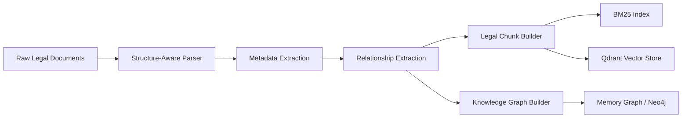
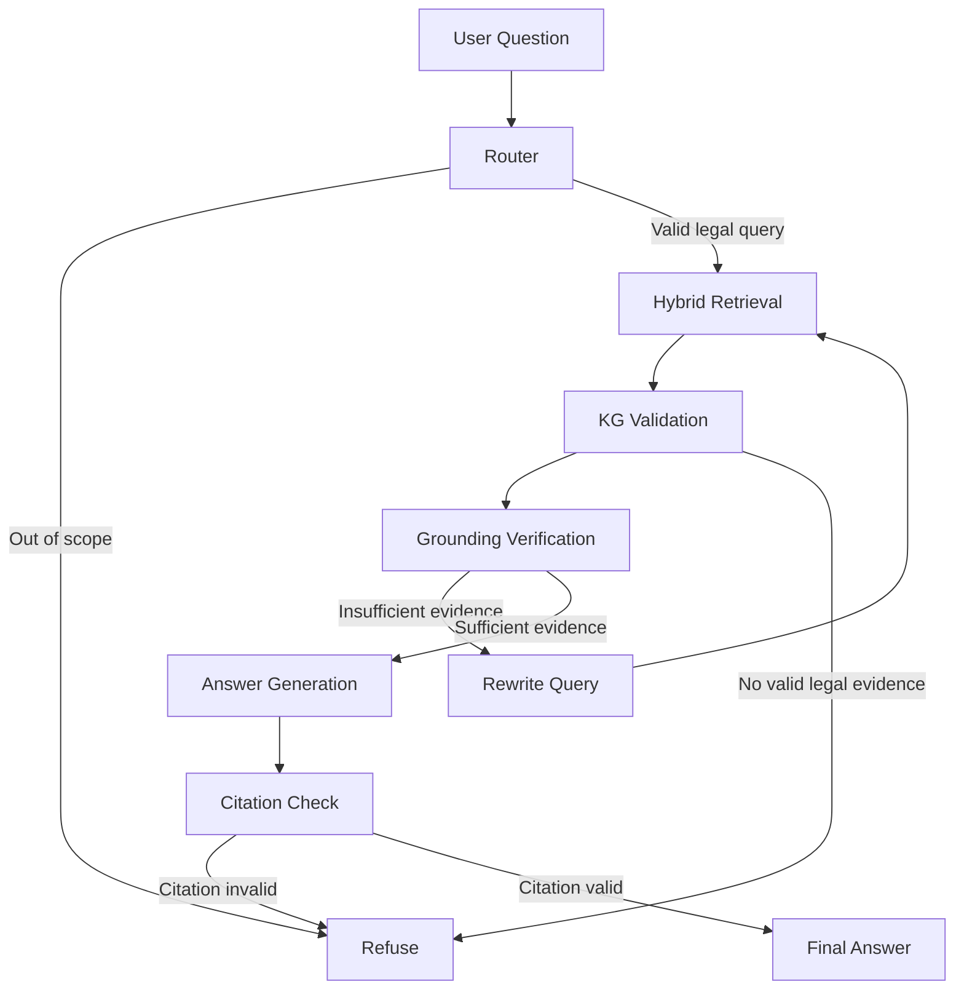
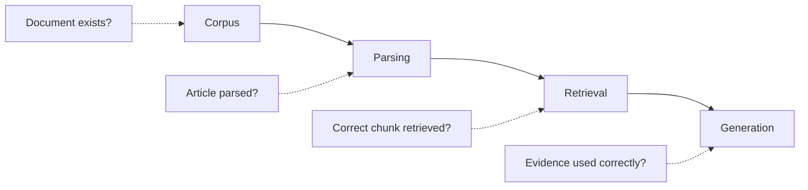

<div align="center">

```
                                                          ██╗   ██╗███╗   ██╗      ██╗     ███████╗ ██████╗  █████╗ ██╗
                                                          ██║   ██║████╗  ██║      ██║     ██╔════╝██╔════╝ ██╔══██╗██║
                                                          ██║   ██║██╔██╗ ██║█████╗██║     █████╗  ██║  ███╗███████║██║
                                                          ╚██╗ ██╔╝██║╚██╗██║╚════╝██║     ██╔══╝  ██║   ██║██╔══██║██║
                                                           ╚████╔╝ ██║ ╚████║      ███████╗███████╗╚██████╔╝██║  ██║██║
                                                            ╚═══╝  ╚═╝  ╚═══╝      ╚══════╝╚══════╝ ╚═════╝ ╚═╝  ╚═╝╚═╝
                                                                 A G E N T   ·   R e t r i e v a l - G r o u n d e d
```

# Vietnamese Legal AI Agent

*A production-oriented, version-aware RAG agent for Vietnamese legal question answering*

[](#7-tech-stack)
[](#7-tech-stack)
[](#7-tech-stack)
[](#7-tech-stack)
[](#7-tech-stack)
[](#20-limitations)
[](#14-evaluation)

</div>

Combines **hybrid retrieval, reranking, a Legal Knowledge Graph, LangGraph orchestration, deterministic citation validation, evaluation, monitoring, and refusal policies** so answers stay grounded in retrieved evidence instead of unsupported model knowledge.

> ⚠️ **Disclaimer:** Information-retrieval / research system only. Does not replace legal advice from a qualified lawyer or authorized government agency.

**🔗 Live Demo:** [Add demo link here](YOUR_DEMO_LINK)

<details>
<summary><b>📑 Table of Contents</b></summary>

1. [Overview](#1-overview) · 2. [Key Features](#2-key-features) · 3. [Architecture](#3-system-architecture) · 4. [Agent Responsibilities](#4-agent-responsibilities) · 5. [Design Thinking](#5-design-thinking-why-these-choices) · 6. [Project Structure](#6-project-structure) · 7. [Tech Stack](#7-tech-stack) · 8. [Quick Start](#8-quick-start-mvp--no-gpuexternal-llmqdrantneo4j-required) · 9. [Build KB](#9-build-the-knowledge-base) · 10–12. [Run It](#1012-run-it) · 13. [Production Config](#13-production-configuration) · 14. [Evaluation](#14-evaluation) · 15. [Testing](#15-testing) · 16. [Failure Diagnosis](#16-failure-diagnosis-4-layers) · 17. [Monitoring](#17-monitoring) · 18. [CI/CD](#18-cicd) · 19. [MVP Scope](#19-current-mvp-scope) · 20. [Limitations](#20-limitations) · 21. [Engineering Principles](#21-engineering-principles) · 22. [Acknowledgements](#22-acknowledgements) · 23. [Latest Updates](#23-latest-implementation-updates)

</details>

---

## 🧭 1. Overview

Legal QA is harder than ordinary document search: the system must find the right provision, distinguish active vs. expired documents, follow relationships between laws and guiding documents, and avoid answering when evidence is insufficient. Two core principles drive the design:

1. **Grounded-or-refuse** — the agent answers only from retrieved, validated evidence; insufficient evidence → refusal, not a guess.
2. **Version-aware reasoning** — documents are checked against effective status and relationships before they can support an answer.

## ✨ 2. Key Features

- Structure-aware parsing (Document → Chapter → Section → Article → Clause → Point) + metadata extraction (number, authority, dates, status)
- Rule-based legal relationship extraction
- Hybrid retrieval: BM25 + dense vectors → Reciprocal Rank Fusion (RRF) → cross-encoder reranking
- Legal Knowledge Graph for version/relationship validation
- LangGraph multi-step workflow with query rewriting and retrieval self-correction
- Deterministic citation auditing + grounding/claim-support verification
- Explicit refusal paths for unsupported answers
- FastAPI REST API, Streamlit UI, offline MVP mode with deterministic stubs
- Production-shaped Qdrant + Neo4j + vLLM deployment
- Golden-set evaluation, regression testing, runtime monitoring, CI pipeline

## 🏗️ 3. System Architecture

**Offline Ingestion Pipeline** — preserves legal structure instead of splitting by character length. A chunk = one Clause (or a full Article when no clauses exist); long clauses split only at Points.



**Online Agent Pipeline** — retrieval quality, legal validity, and citation correctness are explicit control points, not an afterthought (i.e. not a naive Question → Retrieve → LLM → Answer chain).



## 🧩 4. Agent Responsibilities

| Component | Responsibility |
|---|---|
| `router` | Classifies intent, rewrites queries, extracts document/article references, routes requests |
| `retrieve` | Dense + sparse retrieval, RRF fusion, reranking |
| `kg_validate` | Checks legal status, follows document relationships |
| `verify` | Measures grounding quality, decides on retry |
| `answer` | Generates answer strictly from validated evidence |
| `citation_check` | Deterministically audits citations, validates atomic claims |
| `refuse` | Controlled refusal when evidence is insufficient/invalid |

Retrieval retries are bounded by `MAX_RETRIEVAL_ATTEMPTS` to prevent uncontrolled loops.

## 💡 5. Design Thinking (Why These Choices)

- **BM25 + Dense + RRF, not vector search alone** — legal queries often hinge on exact document/article/clause numbers and phrases, which sparse retrieval captures better than embeddings alone. RRF combines BM25 and vector *rank positions* rather than raw scores, which aren't on comparable scales.
- **Knowledge Graph** — legal documents are interconnected (e.g. Article → Guiding Decree → current status). The KG models relationships (`HUONG_DAN` guidance, `THAY_THE` replacement, `SUA_DOI` amendment, `BAI_BO` repeal, `CAN_CU` legal basis) so evidence is validated beyond text similarity.
- **Deterministic citation gate, not LLM self-grading** — Generated Answer → Citation Extraction → Evidence Matching → Legal Status Validation → Pass/Refuse. Unsupported citations are rejected outright.
- **Refusal as a first-class outcome** — a confident wrong answer is worse than a refusal. Enough evidence → Answer; insufficient/invalid/out-of-scope → Refuse. This makes reliability a system property, not just a prompt instruction.

## 📁 6. Project Structure

```text
AIAgent_phapluatVN/
├── src/legal_agent/
│   ├── domain/          # Core legal data models
│   ├── ingestion/        # Parsing, metadata, relations, chunking
│   ├── indexing/         # BM25, embeddings, Qdrant
│   ├── retrieval/        # Hybrid retrieval and reranking
│   ├── kg/                # Legal Knowledge Graph backends
│   ├── llm/               # LLM interfaces and clients
│   ├── agents/            # LangGraph workflow and agent nodes
│   ├── monitoring/        # Run logs, metrics, tracing
│   ├── evaluation/        # Golden sets and evaluation runners
│   └── api/                # FastAPI application
├── app/streamlit_app.py    # Web interface
├── scripts/                 # CLI, ingestion, eval, diagnosis, servers (see §23.10)
├── data/{raw,samples,eval}/
├── tests/
├── docker/{Dockerfile,docker-compose.yml}
├── .github/workflows/{ci.yml,deploy.yml}
├── pyproject.toml · requirements.txt · .env.example · render.yaml
```

## 🛠️ 7. Tech Stack

| Layer | Technology |
|---|---|
| Language | Python 3.11+ |
| Agent Orchestration | LangGraph |
| API / UI | FastAPI / Streamlit |
| Sparse / Dense Retrieval | BM25 / Sentence Transformers (configurable) |
| Reranking | BGE reranker (configurable) |
| Vector DB / Graph | Qdrant / Neo4j (or in-memory) |
| LLM | vLLM OpenAI-compatible API |
| Evaluation / Testing / Lint | Custom golden-set eval / Pytest / Ruff |
| Deployment | Docker, GitHub Actions, Render |

## 🚀 8. Quick Start (MVP — no GPU/external LLM/Qdrant/Neo4j required)

```bash
git clone <your-repository-url>
cd AIAgent_phapluatVN

# venv
python -m venv .venv && source .venv/bin/activate   # Windows: .venv\Scripts\activate

pip install -r requirements.txt

cp .env.example .env   # Windows: Copy-Item .env.example .env
```

Default `.env` keeps the first run local & deterministic:

```text
APP_PROFILE=mvp
LLM_BACKEND=stub
EMBEDDING_BACKEND=stub
RERANKER_BACKEND=stub
QDRANT_MODE=memory
GRAPH_BACKEND=memory
```

## 📚 9. Build the Knowledge Base

```bash
python scripts/ingest_priority.py    # included priority corpus
python scripts/run_ingestion.py      # normal ingestion pipeline
```

Pipeline: `Load Documents → Parse Legal Structure → Extract Metadata → Extract Legal Relations → Build Legal Chunks → Build BM25 + Dense Index → Build Knowledge Graph`

## ▶️ 10–12. Run It

- **Streamlit UI:** `python scripts/run_ui.py` → http://localhost:8501 (Q&A, evidence inspection, execution trace, monitoring, evaluation, document lookup)
- **REST API:** `python scripts/run_api.py --port 8080` → docs at http://localhost:8080/docs
  ```bash
  curl -X POST http://localhost:8080/ask -H "Content-Type: application/json" \
    -d '{"question": "What legal document currently guides Article 26 of the Law on Enterprises?", "include_trace": true}'
  ```
- **CLI:** `python scripts/ask_cli.py "What are the requirements for establishing an enterprise?"`

## 🏭 13. Production Configuration

```text
                Streamlit
                    │
                FastAPI
                ┌───┴───┐
             Qdrant   Neo4j
           (Vector DB) (KG)
                │
              vLLM (LLM Server)
```

```bash
docker compose -f docker/docker-compose.yml up -d
vllm serve Qwen/Qwen2.5-7B-Instruct --max-model-len 8192 --port 8000
```

```env
APP_PROFILE=prod
LLM_BACKEND=openai_compatible
LLM_BASE_URL=http://localhost:8000/v1
LLM_MODEL=Qwen/Qwen2.5-7B-Instruct
EMBEDDING_BACKEND=sentence_transformers
RERANKER_BACKEND=flag_embedding
QDRANT_MODE=server
GRAPH_BACKEND=neo4j
```

Then rebuild: `python scripts/run_ingestion.py`

## 📊 14. Evaluation

```bash
python scripts/run_eval.py
python scripts/run_eval.py --fail-under 0.8
python scripts/run_eval.py --regression --diagnose-failures
```

| Metric | Purpose |
|---|---|
| `retrieval_recall` | Required evidence enters the retrieval pool |
| `citation_recall` | Correct provisions are cited |
| `citation_precision` | Generated citations are actually supported |
| `stale_citation_rate` | Expired documents incorrectly cited (**must stay 0 — critical failure otherwise**) |
| `status_accuracy` | System answers or refuses correctly |
| `retry_rate` | How often retrieval self-corrects |
| `avg_latency` | End-to-end response time |


## ✅ 15. Testing

```bash
pytest                          # fast tests
pytest -m slow                  # integration tests
ruff check src tests scripts app
```

Covers: parsing, chunk boundaries, citation parsing, KG relationships, version propagation, hybrid retrieval, agent routing, self-correction, refusal behavior, citation validation, monitoring, evaluation, API contracts, integration.

## 🔍 16. Failure Diagnosis (4 Layers)

When an answer is wrong, the project identifies which layer failed *before* touching the prompt:



| Layer | Question | Typical Fix |
|---|---|---|
| a. Corpus | Does the source document exist in the KB? | `scripts/ingest_priority.py` |
| b. Parse | Was the Article/Clause parsed correctly? | `ingestion/parser.py`, `patterns.py` |
| c. Retrieval | Did the correct chunk enter the pool? | `retrieval/hybrid.py`, embeddings, reranker |
| d. Generation | Was retrieved evidence used correctly? | `agents/nodes/answer.py`, prompts |

The first failing layer is the root cause; later layers are marked "blocked" so prompt changes don't mask corpus/retrieval bugs.

```bash
python scripts/diagnose.py
python scripts/run_eval.py --regression --diagnose-failures
```

## 📡 17. Monitoring

Logs to `data/processed/run_log.jsonl`: refusal rate, retry rate, total/node-level latency, p50/p95, execution traces.

```bash
curl http://localhost:8080/metrics
curl http://localhost:8080/runs?limit=20
```

Optional LangSmith tracing via `LANGSMITH_TRACING`, `LANGSMITH_API_KEY`, `LANGSMITH_PROJECT` env vars.

## 🔄 18. CI/CD

`Lint → Unit Tests → Integration Tests → Evaluation Gate → Docker Build → Deployment`

Five CI jobs — **lint** (Ruff), **test** (fast suite, Py 3.11/3.12), **integration** (slow tests vs. real indexes/corpus), **evaluate** (golden-set + threshold gate, uploads report as artifact), **docker** (build + `/live` smoke test). The evaluation job can fail the build below threshold. Deployment uses the Render deploy hook and waits for `/live` to become healthy.

## 📦 19. Current MVP Scope

Domains covered: Constitution, Criminal Law, Civil Law, Labor Law, Enterprise Law, Administrative violations, Marriage & family law — plus a smaller sample corpus for demos. Evaluation includes both domain-specific regression cases and explicit refusal cases.

## ⚠️ 20. Limitations

- Some source documents incomplete/unavailable upstream
- MVP stub LLM is deterministic — not a real model-quality benchmark
- Rule-based relationship extraction may miss complex legal wording
- Production embedding/reranking need more compute
- Legal content changes over time and should be refreshed from authoritative sources
- Not a substitute for professional legal advice

## 🎯 21. Engineering Principles

- **Evidence before generation** — the LLM is not the source of truth; retrieved evidence is.
- **Structure before similarity** — legal hierarchy/metadata preserved before embedding.
- **Retrieval before prompting** — investigate corpus/parsing/retrieval before touching prompts.
- **Deterministic checks where possible** — citation support & legal status shouldn't depend entirely on the LLM.
- **Measure before optimizing** — retrieval, citation, refusal, and latency evaluated continuously.
- **Production-shaped from day one** — MVP runs offline; architecture has clear paths to Qdrant, Neo4j, vLLM, monitoring, CI/CD, deployment.

## 🙏 22. Acknowledgements

Built on open-source technologies: LangGraph, LangChain, Qdrant, Neo4j, FastAPI, Streamlit, the PyTorch ecosystem, and related tooling.

---

## 🆕 23. Latest Implementation Updates

Extends the original pipeline with a fuller local workflow, stronger corpus validation, persistent conversations, and production-oriented CI checks.

**23.1 Local Document Ingestion** — add missing legal documents manually (`.html`/`.txt`/`.pdf`) via the same parsing/metadata-validation pipeline as the main corpus (required metadata like title/status is validated before acceptance):
```bash
python scripts/ingest_local_document.py "C:/Downloads/luat-dat-dai.html" \
  --label "Luật Đất đai 2024" --title "Luật Đất đai" --doc-number "31/2024/QH15" \
  --status "Còn hiệu lực" --effective "01/08/2024" --issuing-body "Quốc hội" --field "Đất đai"
python scripts/run_ingestion.py
```

**23.2 Priority Corpus & Source-of-Truth Metadata** — now uses `th1nhng0/vietnamese-legal-documents` (~171,556 documents) and distinguishes document types instead of relying on title keywords. Corpus metadata is the source of truth for effective dates, issuing bodies, and status; duplicate records are reconciled (content from one, metadata from another, most-conservative legal status). Large files use column pruning / row-group reads instead of full in-memory loads.

**23.3 Real-Document Parsing Validation** — validated against real documents, not just fixtures: **0.0%** of documents in the measured priority corpus parse to zero Articles (Docling not required for those).

| Document | Articles | Clauses | Points |
|---|---|---|---|
| Constitution 2013 | 120 | 244 | 0 |
| Criminal Code 2015 | 426 | 1,397 | 2,932 |
| Civil Code 2015 | 689 | 1,418 | 312 |
| Labor Code 2019 | 220 | 648 | 287 |
| Law on Handling Admin. Violations 2012 | 142 | 432 | 418 |

**23.4 Golden-Set Verification** — `python scripts/verify_goldens.py` checks golden labels against the underlying documents to prevent false evaluation signal from bad expected citations. `python scripts/find_article.py "search phrase"` helps locate candidate provisions. Regression suite spans constitutional, criminal, civil, labor, enterprise, administrative, and marriage/family law, plus explicit refusal cases.

**23.6 Persistent Conversation History** — Streamlit app persists to SQLite (`data/processed/conversations.db`): conversation create/rename/reload/delete, message persistence, message counts, recent-history queries, JSON payload storage for evidence/grounding/traces. SQLite chosen for local single-user use (transactions, indexes, FK cascading, WAL mode, no extra service). Timestamps retain local timezone so sidebar grouping stays correct.

**23.7 Updated Streamlit Experience** — full-page chat UI: dark theme with single accent, fixed bottom input, right/left-aligned messages, sidebar history grouped into Today/Yesterday/7 days/30 days/Older, reloadable conversations (evidence + grounding + traces), two-step delete, keyboard-focus support, touch-device support. Legal effect status shown as text, not color-only.

**23.8 Four-Layer Failure Diagnosis** — see §16 (now the standard workflow: `scripts/diagnose.py`, `run_eval.py --regression --diagnose-failures`).

**23.9 Expanded CI/CD Gates** — see §18 (5 jobs: lint, test, integration, evaluate, docker).

**23.10 Current Scripts**
```text
scripts/
├── ask_cli.py            ├── ingest_priority.py     ├── run_eval.py
├── diagnose.py            ├── run_api.py              ├── run_ingestion.py
├── find_article.py        ├── run_ui.py                └── verify_goldens.py
└── ingest_local_document.py
```

**23.11 Engineering Takeaway**

```text
Real Legal Corpus → Structure-Aware Ingestion → Hybrid Retrieval + Reranking
→ Knowledge Graph Validation → Grounding Verification → Evidence-Constrained Generation
→ Deterministic Citation Gate → Answer / Refuse → Evaluation + Monitoring + CI/CD
```

**The LLM is not the source of truth — validated legal evidence is.**

<div align="center">

---

⚖️ **Vietnamese Legal AI Agent** · Built with LangGraph · Qdrant · Neo4j · vLLM

</div>
